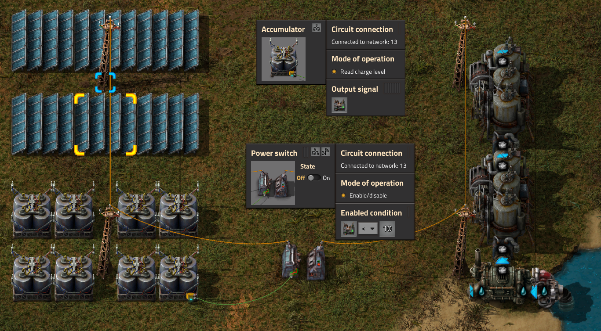
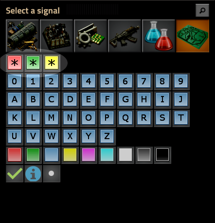

# Mortal's Guide to the Factorio Circuit Network

## Table of Contents

- [Mortal's Guide to the Factorio Circuit Network](#mortals-guide-to-the-factorio-circuit-network)
  - [Table of Contents](#table-of-contents)
  - [1. Introduction](#1-introduction)
  - [2. The Basics](#2-the-basics)
    - [2.1 Time for an example!](#21-time-for-an-example)
    - [2.2 So many Signal Types](#22-so-many-signal-types)
    - [2.3 Controlling something](#23-controlling-something)
    - [2.4 Manipulating signals](#24-manipulating-signals)
    - [2.5 First logic](#25-first-logic)
    - [2.6 Everything, Anything & Each](#26-everything-anything--each)
  - [3 Ticks, Delay & Propagation](#3-ticks-delay--propagation)
    - [3.1 Feedback > Clocks](#31-feedback--clocks)
    - [3.2 Latches](#32-latches)
    - [3.3 Even more creepy stuff](#33-even-more-creepy-stuff)

## 1. Introduction

Welcome, mortal :yum: After spending over 1k hours with this fantastic game (and currently setting out to make it 2k), I've accompanied a few people on their journey. Most of them struggled to get a solid grasp of the Factorio circuit network, let alone its intricacies.

There are already a few tutorials around (like [Circuit Network Cookbook](https://wiki.factorio.com/Tutorial:Circuit_network_cookbook) & [Combinator Tutorial](https://wiki.factorio.com/Tutorial:Combinator_tutorial)) but I never thought they were good at teaching this stuff to beginners, I'm sorry to say. Although those sources are not wrong about the topic and provide recipes, I always found them lacking in a proper approach to teach people how to do stuff on their own and get creative.

So, I'm setting out to give it another try and go step-by-step in basically writing a "Factorio Circuit Network for Dummies" tutorial. I'll also strive to include as many pictures and explanation as possible as well as continuously improving it. You can also help by [raising issues](https://github.com/Some-Yes-Man/FactorioNetwork/issues) over on GitHub.

## 2. The Basics

So what exactly is the [Circuit Network](https://wiki.factorio.com/Circuit_network), besides a good read?!

A circuit network is a collection of buildings connected by [red wire](https://wiki.factorio.com/Red_wire) and/or [green wire](https://wiki.factorio.com/Green_wire). Those wires are items which can be crafted by the player or, this being Factorio, an assembly machine. For now I'll act as if there's only one color, green. More about that later. Said wires transport what is called "*signals*". You can either directly connect two buildings using a red/green wire connection or attach the wires to your existing power poles.

### 2.1 Time for an example!

Here we have a tiny network, consisting of a power pole with two chests attached to it using green wire. Both broadcast their respective contents, adding up to the signals shown on the right side.
As is happens, the "strength/height/amplitude" of the iron signal is 100, the one for copper is 200. Pretty obvious, it's the number of plates in the chests and is from now on called *value of the signal*.

Adding 100 iron plates to the right-hand chest, brings both signals up to the same value. Chests send out all the content and for the network it doesn't matter where the **signals** are coming from, they just **add up**.

Exchanging one of the chests with a [constant combinator](https://wiki.factorio.com/Constant_combinator) (can send any signal you choose) and configuring it to send a signal of -200 (yes, negative 200 iron plates), the new sum of all signals is a single -100 iron signal. Again, **the network** (ie the wire) just **adds up every signal type**.

*Important!* The network always contains *ALL* possible signals, it's just that initially they are all zero. Looking back at our copper-iron example the actual state of the network looks more like this:

 |  |  |  | . . . | . . . |  |  | . . . | . . . | `A` | `B` | `C` | . . .
:---: | :---: | :---: | :---: | :---: | :---: | :---: | :---: | :---: | :---: | :---: | :---: | :---: | :---:
200 | 200 | 0 | 0 | 0 | 0 | 0 | 0 | 0 | 0 | 0 | 0 | 0 | 0

If you look at a connected power pole, the values that are zero are just not shown, that's all. Sending 200 steel into the system while also sending -200 to the same system, will render the value to be zero and make it disappear from the displayed signals.

### 2.2 So many Signal Types

So, anything that can be put into a chest, can be broadcast as a signal (panel #1 to #4). Just wire up all your chests and you'll have an overview what items (and which amount) exists in your factory. The same goes for all kinds of fluids (see panel #5), as you can also wire up your [storage tanks](https://wiki.factorio.com/Storage_tank) (each holds up to 25k of fluid).

  

And then there are the [virtual signals](https://wiki.factorio.com/Circuit_network#Virtual_signals).

Assume someone actually connects all his or her chests, there would be no kind of signal left to communicate anything else over the network. Train stations for example can read the ID of a train. In order to send the ID over the network, the person might want to choose the *locomotive signal*. But, it's already taken because the chests communicate the number of locomotives in storage.

Luckily there is a number (I'm told it's 48) of non-item-related signals to pick from (see panel #6 above). So the train ID could be send as signal "A" for example, while it's content still refers to the item signals of course. There are also color signals in there (red, green, blue and so on). Those can even be used by lamps for automatic coloring.

Maybe you already know or have heard that there are also three very special *virtual signals* that are also called *logic signals*. Those would be `Everything`, `Anything` and `Each` (the red, green and yellow star symbol on panel #6). They are extremely helpful and I'll cover them later, due to their complexity.

### 2.3 Controlling something

Using what we learned so far, we can build a small network that's actually controlling something. The chest on the left is sending its content into the network (2.4k iron plates) and six other buildings use it as input. On the one hand we have the belt which is only enabled if the iron plate signal drops below 2k. On the other hand we've got 5 lamps that light up in steps of 960 iron plates (20% of the maximum amount of iron in the chest).

Okay, apparently there are a bunch of [buildings producing signals](SignalSources.md) and there are other [buildings which can be controlled](SignalSinks.md) by them. Some of the buildings fall in both categories. Now that you know how to get the signals out of the first kind and into the second kind of buildings, you already can build simple control mechanisms.

A fairly easy and common one is the controlled power switch to attach/detach your backup steam engines after switching to solar power. You only want the steam to kick in if the accumulator charge drops below a certain level. So output the charge and feed it into the power switch. In this case, attach the engines as soon as the charge is below 10%. This way the solar panels and accumulators are always connected to the factory (left side of the picture), while steam power is only ever used when it's actually needed.

Easy! But that can't be it, right?!

### 2.4 Manipulating signals

So far, you are able to directly control things that take input signals by using the output from other buildings. What about manipulating the signals, doing some calculations or translating facts into binary signals?

...

### 2.5 First logic

But what if you wanted to combine different signals into more complex conditions in order to control something? Fear not, this is Factorio and the factory will provide!

> basic building blocks: AND, OR, XOR, ..
> plus example and pictures

### 2.6 Everything, Anything & Each

> 3x example plus picture

## 3 Ticks, Delay & Propagation

> tick explanation
> bad delay chain example

### 3.1 Feedback > Clocks

> stuff

### 3.2 Latches

> stuff

### 3.3 Even more creepy stuff

> like I said, stuff
